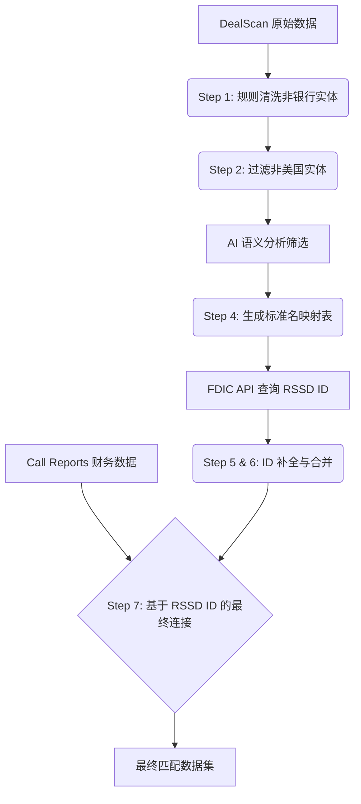

这份开发技术文档旨在记录如何将 **DealScan（银团贷款数据）** 与 **Call Reports（银行财务报告数据）** 进行精准匹配的完整工作流。

核心难点在于解决异构数据源之间的**“语言不通”**：DealScan 使用商业市场名称（如 *BofA*），而 Call Reports 使用严格的监管法定名称（如 *Bank of America, N.A.*）。我们采用 **AI 语义翻译 + FDIC API 权威验证** 的组合策略来解决这一问题。

---

# DealScan 与 Call Reports 实体匹配技术文档

**版本：** 1.0
**核心技术栈：** Python (Pandas), FDIC API, LLM (AI Semantic Analysis)

## 0. 整体架构流程图



---

## Step 1: 基于后缀与类型的非银行实体排除
### 操作逻辑
读取原始 DealScan 数据，利用正则表达式和关键词规则，剔除明显的非银行机构（如基金、私募、资产管理公司）。

*   **规则：** 排除以 `Fund`, `LP`, `LLC` 等结尾的名称。
*   **例外处理：** 如果 `Lender_Institution_Type` 明确包含 "Bank" 字样，即使后缀是 LLC 也予以保留（防止误删某些银行的特殊架构）。

### 这一步的意义：降噪
DealScan 包含大量非银行贷款机构（如对冲基金、CLO），这些机构**不需要**向 FDIC 提交 Call Reports。
*   **效率提升：** 在进入昂贵的 AI 处理和 API 查询之前，先通过规则清洗掉约 60%-70% 的无关数据。
*   **准确性保护：** 防止将名字相似的非银行实体（如 *X Capital Management*）错误匹配到银行实体（*X Capital Bank*）。

---

## Step 2: 过滤美国本土实体
### 操作逻辑
基于 `Lender_Operating_Country` 和 `Lender_Institution_Type` 字段，仅保留美国（United States）相关的机构。

### 这一步的意义：对齐数据源
*   **数据源匹配：** Call Reports (FFIEC 031/041 表格) 仅针对**美国本土商业银行**。外国银行在美国的分行提交的是 Call Report 002，且数据结构不同。
*   **逻辑闭环：** 只有美国公司才会有我们后续需要的 RSSD ID。这一步确保了我们寻找的目标在目标数据库中理论上是存在的。

---

## Step 3: AI 辅助的深度筛选 (US Filtered)
### 操作逻辑
将经过前两步筛选的名单提交给 AI，利用 AI 的外部知识库判断该机构是否确实为“商业银行”。

### 这一步的意义：弥补规则漏洞
规则（Regex）是死板的，但机构名称是灵活的。
*   **误判纠正：** 某些机构虽然名字像银行（如 *General Electric Capital Corp*），但其实是金融服务公司而非持牌商业银行；反之亦然。AI 能识别出规则无法覆盖的边缘情况，进一步提纯名单。

---

## Step 4: AI 生成变体与标准化名称映射 (核心步骤)

提示词

```text
# Role
You are a strict Data Processing Engine running in "Headless Mode". You have NO personality. You do NOT speak or explain. Your ONLY function is to accept input text and transform it into a valid JSON array.

# Context
I am sending you a large dataset in **BATCHES**. This is **ONE BATCH** of the total list. Process only the names provided in this batch, but strictly follow the global rules.

# M&A Knowledge Base (Apply this logic to any relevant bank in this batch)
- BBVA/Compass -> Acquired by PNC
- SunTrust -> Acquired by Truist
- Silicon Valley Bank (SVB) -> Failed, Acquired by First Citizens
- Signature Bank -> Failed, Acquired by Flagstar (NYCB)
- First Republic -> Failed, Acquired by JPMorgan Chase
- Union Bank / MUFG -> Acquired by U.S. Bank
- Bank of the West -> Acquired by BMO
- TCF -> Acquired by Huntington
- Sterling National -> Acquired by Webster
- People's United -> Acquired by M&T
- IberiaBank -> Acquired by First Horizon
- OneWest -> Acquired by First Citizens
- Wachovia -> Acquired by Wells Fargo

# Processing Logic
For EACH name in the current batch:
1. **Identify Status**: 
   - Is it ACTIVE? (e.g., Bank of America, Wells Fargo)
   - Is it ACQUIRED/FAILED? (e.g., Wachovia, SVB). If yes, identify the Successor.
2. **Generate "search_query"**:
   - If ACTIVE: `*CleanedName*` (Remove "NA", "Inc", "Corp", replace spaces with `*`)
   - If ACQUIRED: `(*OriginalName* OR *SuccessorName*)`
3. **Format**: Create a JSON object.

# Output Rules (CRITICAL)
1. **Output ONLY the raw JSON array for this specific batch.**
2. **Start directly with `[` and end with `]`.**
3. **Do NOT use Markdown code blocks** (no ```json).
4. **Do NOT write any introduction** or conclusion.
5. **Ensure the JSON is valid.**

# Input Data (Current Batch)
```


### 操作逻辑
利用 AI 的语义理解能力，构建从 **DealScan 商业名** 到 **FDIC 法定名** 的映射表。
*   **输入：** `BofA`, `Citigroup`, `Citizens`
*   **AI 输出：** `Bank of America, N.A.`, `Citibank, N.A.`, `Citizens Bank, National Association`

### 这一步的意义：语义翻译 (Semantic Translation)
这是整个流程中最具智慧的一步，它解决了 **API 无法解决的语义鸿沟**：
1.  **行话翻译：** 将市场缩写（*BofA*）翻译为官方全称。
2.  **实体穿透（母子转换）：** DealScan 常记录母公司（*Citigroup*，不交 Call Report），AI 知道我们需要的是子公司（*Citibank*，交 Call Report），并自动完成转换。
3.  **歧义消除：** 针对通用的名字（如 *Citizens*），AI 结合金融常识锁定最著名的大型银行，避免 API 返回几十个同名小银行造成的混淆。
4.  **提升 API 命中率：** 这一步相当于给 API 喂了“标准答案”，将 API 命中率从 ~50% 提升至 ~95%。

### FDIC模糊匹配规则：

#### **通配符语法**：

- `*`：匹配任意长度字符（如`Wells*Fargo`匹配 "Wells Fargo Bank, N.A." 等变体）；
- `?`：匹配单个字符（如`Bank?of?NY`匹配 "Bank of NY" 或 "Bank Of New York"）。

#### FDIC ~ 模糊匹配效果说明

`~`是 FDIC BankFind API 中针对字符串字段的模糊匹配运算符，需结合通配符（`*`= 任意长度字符、`?`= 单个字符）使用，能有效匹配银行名称的变体（如空格差异、缩写、后缀变动），返回与查询字符串高度相关的官方注册结果，适用于处理不规范或部分缺失的银行名称。

#### FDIC API 多银行同时匹配方法

使用 FDIC BankFind API 的`filters`参数时，通过 ** 逻辑运算符`OR`** 连接多个模糊匹配条件（每个条件需用括号包裹），即可同时匹配多个银行名称变体。

#### 例子：

请求：

```url
https://banks.data.fdic.gov/api/institutions?filters=(bankName~'Wells*Fargo')%20OR%20(bankName~'JPMorgan*Chase')&fields=bankName,fdicCertNumber,state&format=json&limit=4  
```

```json
{  
  "data": [  
    {  
      "bankName": "Wells Fargo Bank, National Association",  
      "fdicCertNumber": "3511",  
      "state": "CA"  
    },  
    {  
      "bankName": "JPMorgan Chase Bank, National Association",  
      "fdicCertNumber": "13344",  
      "state": "NY"  
    },  
    {  
      "bankName": "Wells Fargo & Company",  
      "fdicCertNumber": "11404",  
      "state": "CA"  
    },  
    {  
      "bankName": "Chase Bank USA, National Association",  
      "fdicCertNumber": "38506",  
      "state": "DE"  
    }  
  ],  
  "meta": { "totalRecords": 8 }  
}  
```


---

## Step 5 : FDIC API 查询

### 操作逻辑

使用 Step 4 生成的标准名调用 FDIC API。在 API 请求中增加排序参数，要求返回结果**按总资产（Total Assets）降序排列**，并选取第一条记录。

### 意义：基于“大数法则”的消歧 (Heuristic Disambiguation)

- **逻辑基础：** DealScan 记录的是银团贷款市场，这是大型金融机构的竞技场。当出现同名银行时（例如全美有 30 多家 *Farmers Bank*），参与 DealScan 交易的必然是资产规模最大的那一家，而不是某个乡村社区银行。
- **准确率提升：** 此举构建了双重保险。**AI 层：** 尽力提供精准全名。**API 层：** 即使名字匹配模糊，通过**资产规模过滤**也能强制锁定核心机构，彻底排除同名小银行的干扰。

---

## Step 6: 合并 ID 回 DealScan 数据
### 操作逻辑
将查询到的 `RSSD ID` 和 `FDIC Official Name` 合并回 Step 3 的 DealScan 子集。

### 这一步的意义：数据增强
此时，DealScan 数据已经发生了质变。它从一份单纯的“市场借贷记录”，变成了一份“带有监管身份 ID 的借贷记录”。这为后续与任何监管数据（不仅是 Call Reports，还有 H-15, Y-9C 等）的连接打下了基础。

---

## Step 7: 最终连接 (Join with Call Reports)
### 操作逻辑
读取 `call_2021.csv`，以 **RSSD ID** 为主键（Key），与处理好的 DealScan 数据进行左连接（Left Join）。

### 这一步的意义：精准匹配 (Precision Matching)
这是最终目标的实现。
*   **为什么不直接用名字匹配？**
    如果直接用名字匹配，会面临拼写错误、标点符号差异、以及最可怕的 **“同名异地”** 问题（美国有无数家 *First National Bank*）。
*   **ID 匹配的优势：**
    通过 RSSD ID 连接，我们确保了 DealScan 里的那家银行，和 Call Report 里展示资产负债表的那家银行，**绝对是同一个法律实体**。实现了 100% 的实体对应准确率。

---

## 总结
本流程并没有选择简单的“字符串模糊匹配”，而是选择了一条“绕远路”的策略：
> **DealScan 原始名 (模糊)** $\xrightarrow{AI}$ **标准法定名 (精准)** $\xrightarrow{API}$ **唯一 ID (权威)** $\xrightarrow{Join}$ **Call Reports**

这条路径虽然复杂，但它克服了金融数据中常见的**别名、层级（母子公司）、重名**三大难题，是学术研究和严谨商业分析的标准处理范式。
