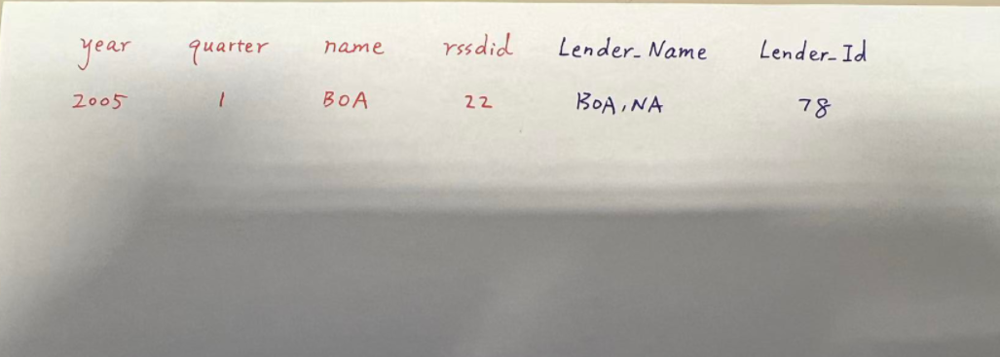
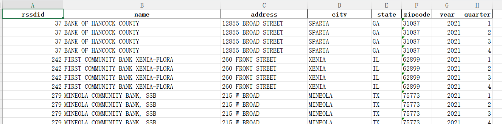
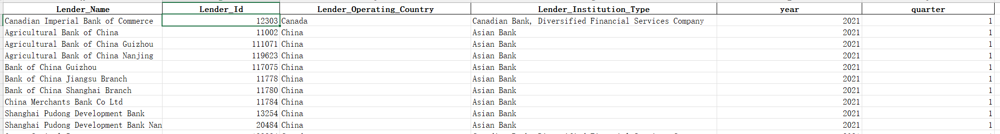

# 0

其中call report data里是从2005-2024每年每家美国银行的季度财务数据，而dealscan是每年发放syndicated loans的贷款数据，每一个dealscan数据代表那一年发放的贷款

**Match的需求是：对每一个call report data里的银行，按季度去当年dealscan data里找是不是有这家银行**

最终的数据结构是如下的面板数据

- year
- quarter
- name
- rssdid
- Lender_Name
- Lender_Id

# 1

## 数据样式

call的数据是干净的，且能用那个id查询到唯一标识的

问题在于dealscan这里很脏，而且fdic的名称检索效果也不是很好

**call数据：**

Call report里只有银行

- **数据规模**：19,874 条记录，涵盖 8 个字段，无大规模缺失值
- **时间范围**：2021 年全年，按 4 个季度划分（每季度记录数均衡，占比 24.6%-25.3%）
- **核心字段**：包含机构标识（rssdid）、机构名称（name）、地址（address）、城市（city）、州（state）、邮编（zipcode）、年份（year）、季度（quarter）

**dealscan数据：**

**Dealscan是syndicated loans的数据，一般来说主要是大银行在放这种贷款，而大银行往往过去是通过兼并收购变大的，主要扰乱的东西是因为investment firms和funds也会放这种贷款，所以dealscan里包含了很多银行以外的扰乱实体**

该数据集是 2021 年 Dealscan 贷款相关数据，主要记录全球贷款机构的基础信息，具有以下核心特征：

- **数据规模**：共 3299 条记录，涵盖 6 个核心字段，数据完整性较高
- **时间范围**：仅包含 2021 年数据，按季度划分（1-4 季度）
- **核心主题**：全球贷款机构（Lender）的身份标识、运营地区及机构类型信息
- **数据质量**：仅`Lender_Institution_Type`字段存在 8.2% 的缺失值，其他字段无缺失

1.1 字段说明

| 字段名称                 | 数据类型 | 说明                               |
| ------------------------ | -------- | ---------------------------------- |
| Lender_Name              | 文本     | 贷款机构名称（如银行、金融公司等） |
| Lender_Id                | 数值     | 贷款机构唯一标识 ID                |
| Lender_Operating_Country | 文本     | 机构运营所在国家 / 地区            |
| Lender_Institution_Type  | 文本     | 机构类型（可能包含多个分类）       |
| year                     | 数值     | 年份（固定为 2021）                |
| quarter                  | 数值     | 季度（1-4）                        |

Rssdid 是金融机构独有的ID，只有机构消失了才会消失，但是两个机构合并的话购买者的id不变，但名字可能变；被买的id消失，但是名字可能被买它的机构继承了，因此有的时候会出现名字没变但是rssdid变了的情况

## 思路

梁嘉伟思路：

我的思路是先利用`fdic`的 `api` 获取 `dealscan` 里面的FRB ID (RSS-ID)，然后利用这个id去匹配call的表

这个情况下唯一的困难点就是检索的精准度了

[BankFind Suite: API Documentation](https://api.fdic.gov/banks/docs/#/Structure/searchInstitutions)

Q：

目前的一个想法是把dealscan的银行名称调用fdic的api进行检索获取的FRB ID (RSS-ID)，然后利用这个id去匹配call的表。这个方法可能会存在的问题就是检索精度，dealscan的name各种变型太奇怪了，能不能高准确度的检索到还是个问题，

把这个继续优化一下的话就是利用大模型把dealscan的混乱的name转化可以被fdic检索的，然后把检索到的rssdid写入到dealscan这张表里面，然后利用rssdid来进行两张表的匹配。通过rssdid来匹配就能保证是同一家银行。这样子准确度就能到90%甚至95%。您那边手动匹配的准确度您预估大概是多少？

A：

有两点需要提醒的：

- 第一，FDIC网站上能查到的银行名称是这个**银行现在的名字**，历史上用过的**旧名字是查不到的**，而我这两个数据都是**历史数据**；
- 第二，Dealscan的毛病就是**银行名字不完全规范**，我想**95%的准确率**就够了，到时候给我的最终结果包含**两个数据里的名字**，这样我可以自己判断一下

还有一点，Dealscan里面除了银行还有investment firm, fund等等其他实体

所以只有一部分能和call report match上

那些`fund`和`investment firm`**不是**我的目标

**NIC上有银行兼并收购信息**，在兼并收购后银行很有可能改名字，如果调用NIC的excel表就可以知道银行兼并收购的时间和之前的名字

Q：

我下午尝试的时候发现用旧名字来检索的话他会弹出来新名字。所以通过旧名字还是能检索到fdic的rssdid的；麻烦您提供一些旧名字让我尝试一下；除了银行以外的实体在fdic上应该检索不到吧

A：

但是我觉得这个不是问题，因为就算有后续也和call report里match不上的，**Call report里只有银行**

Q：

rssdid变了的话哪怕名字没变，应该也不能算同一家银行了吧。被收购的id消失的银行也要匹配到call report变更后的银行里吗？

A：

不不，匹配的是银行每一年的名字和当年的rssdid，被收购后消失的银行要匹配到call report里这个银行在消失前的记录，call report是个panel data

Q：

就是说像2021年三季度A银行收购B银行。保留A银行id，三季度之前AB银行分别匹配。第四季度只需要匹配A，那第三季度怎么匹配

A：

这种情况因为三季度银行B就被收购了，所以银行B就不会file三季度的call report，就不会出现在call report data里了。所以三季度实际上只有银行A会有匹配这样，Call report只有在银行还在已独立实体存在的时候才会file

**一般说来银行一般会以bank或者trust或者co(company), corp（corporation)结尾，那些fund一般会以fund结尾，那些投资公司一般会以investment corp，LLC（Limited liability company）这样结尾**

# 2

帮我简要分析两份数据，我目前要把两份数据中的银行和id对上，其中，dealcan是脏数据，id也不一定正确，calll是整理过的干净数据，请你先帮我写一个匹配两份文件之间id的py脚本

探索美国公司相关信息，这份文件里的lenderid(rssdid)大多不准确（不是严格意义上的bank),所以我们暂时不使用lenderid，请你通过网络搜索和NIC银行历史兼并信息，补充该银行其他名字的写法和被兼并前的名字（如果你某个功能不能很好实现，请告诉我，思考代替方案）

